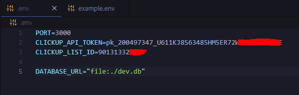
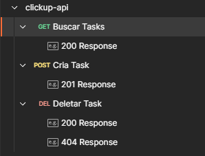

# 📌 ClickUp API - Desafio Técnico Ser Útil - Desenvolvedor Backend

API em Node.js que integra com a plataforma [ClickUp](https://clickup.com/) para criar, consultar e armazenar tarefas localmente, simulando uma interface entre sistemas internos da empresa **Ser Útil**.

---

## 🛠️ Tecnologias Utilizadas

| Tecnologia | Motivo do uso |
|------------|---------------|
| **Node.js v24.1.0** | Plataforma de execução JavaScript no backend |
| **Express** | Framework minimalista para criação das rotas da API |
| **Prisma ORM + SQLite** | Banco de dados local e ORM moderno, rápido para prototipação |
| **Axios** | Cliente HTTP para se comunicar com a API do ClickUp |
| **dotenv** | Gerenciar variáveis sensíveis como tokens e IDs de lista |
| **Postman** | Testes rápidos e visuais dos endpoints |

---

## 📂 Funcionalidades

- 🔄 **Sincronizar tarefas do ClickUp**
- 📝 **Criar nova tarefa no ClickUp + banco local**
- ❌ **Remover tarefa do banco local (sem afetar o ClickUp)**

---

## 📄 Como rodar o projeto

### 1. Clone o repositório

- git clone https://github.com/seu-usuario/clickup-api.git

- cd clickup-api-integration 

### 2. Instale as dependências

- npm install

### 3. Crie um .env na raiz do projeto

### 6. Gere o prisma client

- npx prisma generate

### 5. Execute as migrations

- npx prisma migrate dev --name init

### 6. Inicie o servidor

- npm run start

---

## 🔑 Como obter o API Token e o List ID do ClickUp

### ✅ 1. Obter o API Token

1. Acesse sua conta no [ClickUp](https://clickup.com).
2. No canto inferior esquerdo, clique no seu avatar e selecione **Apps**.
3. Vá até a seção **Personal API Token**.
4. Clique em **Generate** (caso ainda não tenha um).
5. Copie o token gerado e guarde com segurança.

### 📋 2. Obter o List ID

1. Acesse o seu Workspace no ClickUp.
2. Navegue até o **Space > Folder > List** que deseja utilizar.
3. Com a lista aberta no navegador, observe a URL. Ela terá um formato semelhante a este:

- https://app.clickup.com/1234567/v/l/li/90138222357

4. O número final (ex: `90138222352`) é o **List ID**. Copie e utilize no seu arquivo `.env` como `CLICKUP_LIST_ID`.

---

## 🧪 Testando com Postman

Você pode importar rapidamente nossa collection de testes:

📥 [Clique aqui para baixar a collection](./docs/clickup-api.postman_collection.json)

### Como usar:

1. Baixe o arquivo acima.
2. Abra o Postman e clique em **Import**.
3. Selecione o arquivo `clickup-api.postman_collection.json`.

---

### Desenvolvido por **João Pedro** para o processo seletivo da **Ser Útil**.
